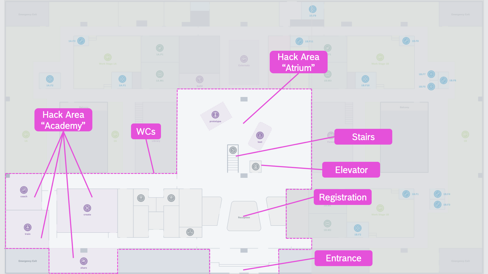
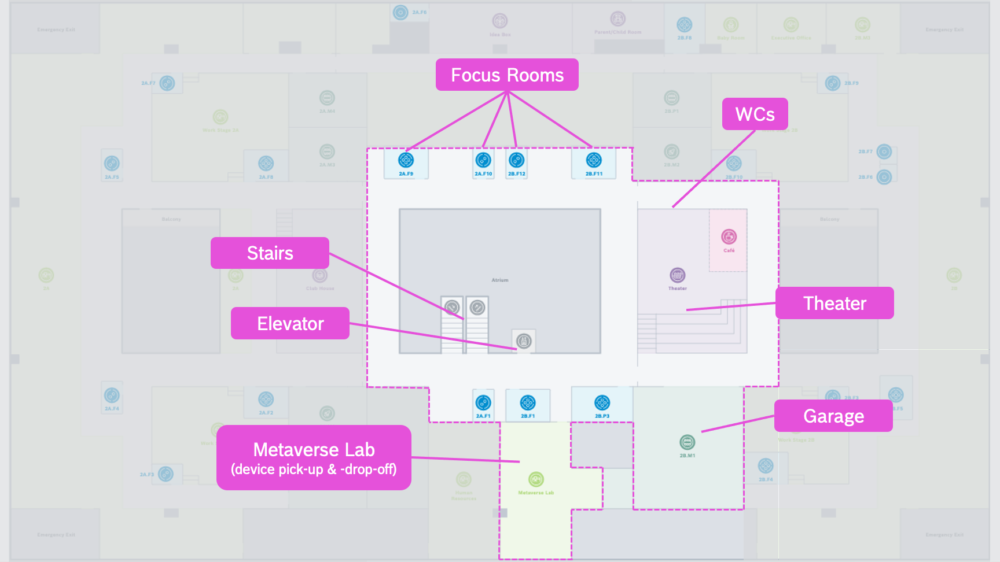
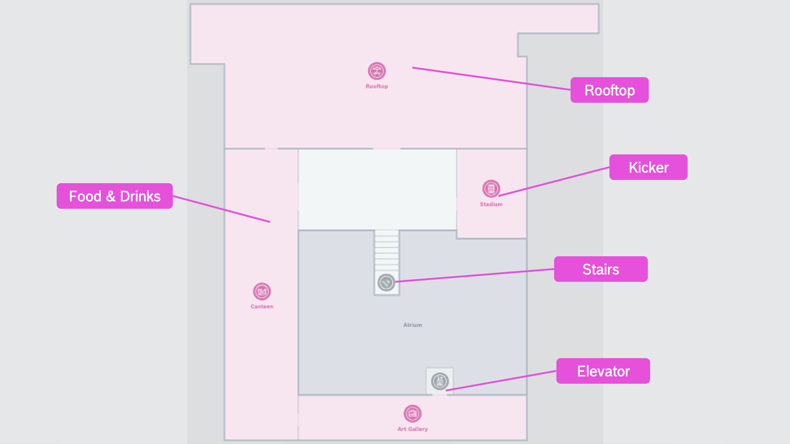

## The Hack Area
Please find in the following the map of the hackathon within the Bosch IoT Campus.
  
**Please note:** We appreciate if you could stay within the dedicated area, as in the rest of the campus people are still working. Thanks a lot! &#x2665;&#x2665;&#x2665;

To download the full plan as pdf, please use the following [link](./hack_area.pdf)

**Floor 1**
<figure>
  
  <figcaption>(right-click and open in new tab to get full resolution)</figcaption>
</figure  >

**Floor 2**
<figure>

<figcaption>(right-click and open in new tab to get full resolution)</figcaption>
</figure  >

**Floor 3**
<figure>

<figcaption>(right-click and open in new tab to get full resolution)</figcaption>
</figure  >